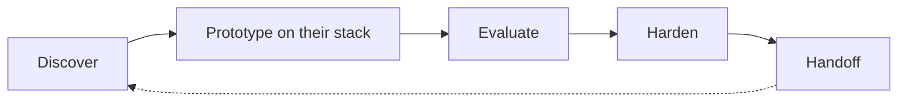

  

  

    <strong>Sr. AI Engineer @ Hexaware</strong> · Chennai · 4 years in ML / NLP / agents
  

  

    I sit with messy production problems and leave <strong>working</strong> AI systems.
  

  

    
    
    
    
  

---

<strong>20-second brief</strong> — click to fold

 

| | |
| :--- | :--- |
| **Who** | Applied / forward-deployed AI engineer. 4 years in ML, NLP, and agent systems. |
| **Now** | Sr. AI Engineer at [Hexaware](https://www.hexaware.com) — agentic delivery on customer stacks. |
| **Do** | Discover the real workflow → prototype on *their* tools → harden → hand off something that runs. |
| **Proof** | [Memory for agents](https://github.com/dakshin-jv/Context-as-Service) · [RPA migration parser](https://github.com/dakshin-jv/migration-tool-parser) · [Trade agent](https://github.com/dakshin-jv/blockchain_trade) · [Local-LLM search](https://github.com/dakshin-jv/real-estate-UseBlocky) |
| **Talk** | [dakshinjv@icloud.com](mailto:dakshinjv@icloud.com) · [LinkedIn](https://www.linkedin.com/in/dakshinjv) |

**Open to** applied AI / FDE / AI engineer roles where the job is shipping with the customer, not only training models.

---

<strong>What I actually do</strong>

 

Not a research-only profile. Most of the work is **applied**: get into the customer's process, pick the thinnest AI that solves it, and make it survive production.

- **Agent systems** — skills, tool orchestration, harnesses, evaluation — not just a chat box
- **Memory & RAG** — scoped, decaying, conflict-aware memory; local-first when data cannot leave the machine
- **Forward deployed delivery** — UiPath estates, wealth / fintech workflows, on-chain analytics: meet the stack, don't ask for a rewrite
- **Classical ML still matters** — ranking, classification, NLP, forecasting when an LLM is the wrong tool

---

## Selected work

Click a repo. Expand a card for the why.

<table>
  <tr>
    <td width="50%" valign="top">
      <h3><a href="https://github.com/dakshin-jv/Context-as-Service">memoryServe / Context-as-Service</a></h3>
      

        
        
        
      

      
Local-first memory for agents: extract → conflict resolve → decay → forget. Hard isolation by project → user → session.

      

        
Why it matters

        Agents that forget or leak context across projects are useless in enterprise. mem0-compatible API. Ollama / Azure OpenAI / Bedrock. SQLite lifecycle.
      

    </td>
    <td width="50%" valign="top">
      <h3><a href="https://github.com/dakshin-jv/migration-tool-parser">UiPath → Power Automate parser</a></h3>
      

        
        
        
      

      
Ingest a <code>.nupkg</code>, score REFramework compliance, emit a graph of workflows, exceptions, selectors, and Config keys.

      

        
Why it matters

        Classic FDE problem: migrate the estate they already run. 14-stage pipeline, Roslyn sidecar, 64 tests. Preserve Init / GetTransaction / Process / EndProcess.
      

    </td>
  </tr>
  <tr>
    <td width="50%" valign="top">
      <h3><a href="https://github.com/dakshin-jv/blockchain_trade">Conversational trade agent</a></h3>
      

        
        
        
      

      
Trader personality from real trade history. Behavioral scoring, streaming replies in first person, references to actual fills.

      

        
Why it matters

        Turns a blotter into an explainable operator the trader can interrogate — not a generic market chatbot.
      

    </td>
    <td width="50%" valign="top">
      <h3><a href="https://github.com/dakshin-jv/agent-skills-engine">Agent skills engine</a></h3>
      

        
        
        
      

      
Toolkit for authoring reusable skills for coding agents and custom agentic systems.

      

        
Why it matters

        Skills change <em>behavior</em>; tools change <em>reach</em>. This is how you productize the former.
      

    </td>
  </tr>
  <tr>
    <td colspan="2" valign="top">
      <h3><a href="https://github.com/dakshin-jv/real-estate-UseBlocky">Natural-language apartment search</a></h3>
      

        
        
        
      

      
FastAPI + local Ollama over listings. Parse intent, filter, answer. Thin on purpose: no cloud round-trip for a housing query.

    </td>
  </tr>
</table>

Earlier applied DS

 

- [LiveOps ride monitoring](https://github.com/dakshin-jv/LiveOps)
- [Country clustering / GDP](https://github.com/dakshin-jv/Country-GDP)
- [DS project archive](https://github.com/dakshin-jv/DataScience-Projects)

---

<strong>Path</strong>

 

| When | Role | Focus |
| :--- | :--- | :--- |
| 2025 — now | **Sr. AI Engineer**, Hexaware Technologies | Agentic delivery, Microsoft AI Foundry, customer-facing AI systems |
| Prior | **Data Scientist**, Centricity WealthTech | ML for private wealth / investment workflows |
| Prior | **On-chain Data Scientist**, Roni Analytics | Crypto market structure, on-chain analytics, trader-facing tools |
| Prior | **Data Scientist (NLP)**, Packt | NLP models and content / intelligence pipelines |

<strong>Stack I ship with</strong>

 

  

**Languages** — Python, TypeScript, SQL, C# (Roslyn sidecar)  
**Models & agents** — Azure OpenAI, AWS Bedrock, Ollama, RAG, skills / harnesses, evaluation  
**Services** — FastAPI, Qdrant, SQLite, MongoDB, React  
**Applied ML** — pandas, scikit-learn, PyTorch, classic NLP  

<strong>Right now</strong>

 

- Building **memoryServe** — lifecycle memory (active → superseded / stale → forgotten) with hard project isolation
- Deepening **agent skills** and Microsoft Foundry / Azure AI Foundry delivery patterns
- Looking at work where I can sit with operators and own the last mile

---

## Live GitHub

Click a chart to open the profile.

  
  
   
  
   
  

---

  <h2>Contact</h2>
  
If you need someone who can walk into an existing estate, find the bottleneck, and leave a system the team will run — write.

  

    <a href="mailto:dakshinjv@icloud.com">dakshinjv@icloud.com</a>
    ·
    <a href="https://www.linkedin.com/in/dakshinjv">LinkedIn</a>
    ·
    <a href="https://github.com/dakshin-jv">GitHub</a>
  

